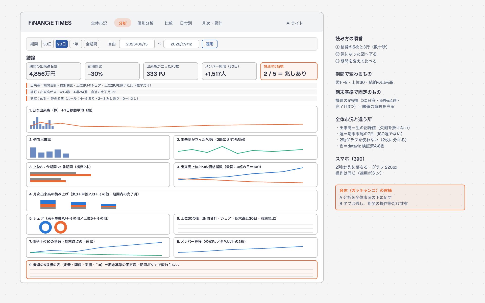
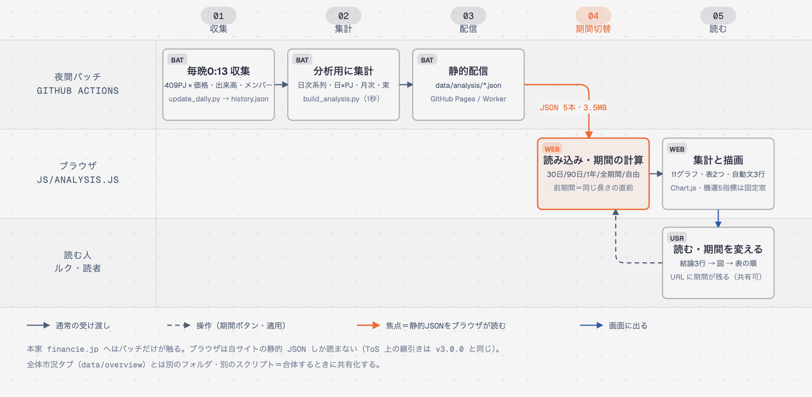

# 「分析」タブ v0.1.0｜設計（2026-09-13）

- 作成：2026-09-13 06:58 JST（dev-lead＝Fable・作りながら詰めた版）。依頼＝ルク 06:33「分析レポートの図を期間切替でダッシュボードに。全体市況 v3.1 とは別タブで一旦作り、後でガッチャンコ」
- 元＝[[company/output/2026-09/2026-09-12_FiNANCiE_分析レポート_直近の動きと機運|分析レポート（2026-09-12）]]・[[company/output/2026-09/2026-09-12_引き継ぎ_FiNANCiE-TIMES-Web_全体市況v3.1|v3.1 の引き継ぎ書]]
- 現在地＝[[00_products/apps/FiNANCiE-times-web/progress|progress.md]]・検証台帳＝[[00_products/apps/FiNANCiE-times-web/VERIFIED|VERIFIED.md]]
- 作業場所＝worktree `.claude/worktrees/analysis-tab`（ブランチ `feature/analysis-tab`・起点 `6528da66`）。ステージング＝Worker `financie-times-analysis-staging`（v3.1 の `financie-times-staging` とは別）

## 結論（先に）

- 新しいタブ「分析」を足し、レポートの図10枚を **期間（30日／90日／1年／全期間／自由）で描き直せる**形にした。数字は毎晩の静的 JSON からブラウザで計算する（本家へのアクセスなし）。
- 全体市況とはファイルを分けた（`js/analysis.js`・`css/analysis.css`・`data/analysis/`・`scripts/build_analysis.py`）。index.html と advanced.js は「タブの追加」だけ＝**合体しやすい**。
- 検査 `tests/check_analysis.js` 38項目 ALL PASS（独立計算と一致・レポートの数字を再現・両テーマ AA・スマホ横はみ出しなし）。

## 画面イメージ

正本＝`diagrams/analysis_tab_screen.html`（SVG 同名・diagram-design 既定スキン）

上から「期間の操作帯 → 結論（KPI 5枚＋自動文3行）→ 図1〜8 → 上位30の表 → 機運の5指標の表」。ルクが数十秒で判断できるよう結論を上に、詳細を下に置く。スマホ（390）では2列が1列に落ちる。

## データの流れ

正本＝`diagrams/analysis_tab_dataflow.html`

| 段 | 何をする | どこ |
|---|---|---|
| 収集 | 毎晩 0:13 JST に 409PJ の価格・24h出来高・30日出来高・メンバー数を記録 | `scripts/update_daily.py` → `data/history.json`（既存） |
| 集計 | history.json から分析用の表5本を書き出す（約1秒） | `scripts/build_analysis.py` → `data/analysis/{series,v24,price,monthly,bundles}.json`（約3.5MB） |
| 配信 | 静的ファイルとして配る | GitHub Pages（本番・未反映）／Worker（ステージング） |
| 期間切替 | ブラウザが JSON 5本を読み、期間から index の範囲を出す | `js/analysis.js` computeRange |
| 描画 | 11グラフ・表2つ・自動文3行を Chart.js で描く | `js/analysis.js` render* |

## 図ごとの定義（レポート → タブ）

| # | レポートの図 | タブの区画 | 期間で変わる？ | 定義・算出 |
|---|---|---|---|---|
| 0 | 結論3行 | 結論（KPI5枚＋自動文3行） | 変わる | 期間合計・前期間比（同じ長さの直前）・出来高が立ったPJ数・メンバー純増（期末直近30日）・機運 n/5。文はテンプレ3本固定＝原因・見通し・閾値の無い形容は書かない |
| 1 | fig01 日次出来高＋7日平均 | 1. 日次出来高と7日平均 | 変わる | 各日の `volume` の全PJ合算。7日平均＝その日を含む暦日7日の記録の平均（記録4日未満なら描かない） |
| 2 | fig02 週次出来高＋出来高が立ったPJ数 | 2.（2枚） | 変わる | 期末を末尾にした暦日7日区切り（先頭の端数は捨てて注記）。PJ数＝週に `volume`>0 の日があるPJ数。**2軸にせず2枚** |
| 8 | fig08 上位8 ダンベル | 3. 上位8：今期間 vs 前期間（横棒2本） | 変わる | 今期間の出来高上位8を、同じ長さの直前の期間と並べる |
| 9 | fig09 CNG・にんプラの指数 | 3. 出来高上位2PJの価格指数 | 変わる | 上位2PJ＝今期間の出来高上位2。基準＝期間内で最初に0より大きい値の日＝100 |
| 3 | fig03 月次積み上げ | 4. 月次出来高 | 変わる | 翌月1〜5日のうち記録件数が窓の最大の90%以上ある最初の日の `volume_data` 合算（2026-02-01 は349件＝途中で止まった日を避けるため）。区分＝束3（NinjaDAO系・令和の虎系・RED系）＋単独3（REAL VALUE・ゆるトークン・メタバース麻雀）＋その他。期間内の完了月が3未満なら直近6か月に広げて注記 |
| 10 | fig10 シェア円 | 5. シェア（2枚） | 変わる | 左＝束3＋単独3＋その他（7区分）、右＝上位5PJ＋その他。期間合計で割る |
| 4 | fig04 上位30表 | 6. 上位30の表 | 変わる | 期間合計・シェア・期末直近30日・前期間比。名前＝個別ページ・↗＝本家 |
| 5 | fig05 価格上位10 | 7. 価格上位10の指数 | 変わる | 上位10＝期末時点の価格上位。基準＝期間内で最初に0より大きい日。9〜10本目は灰色の破線・点線（パレット8色の縛り） |
| 6 | fig06 メンバー | 8. メンバー推移（2枚） | 変わる | 公式PJ（`308_tokenplus`）と全PJ合計（停止PJは最後の値を据え置き）。**2軸にせず2枚** |
| 7 | fig07 5指標表 | 9. 機運の5指標 | **固定（期末基準）** | ①直近30日÷前30日 ≥+20% ②月次2か月連続増（直近の完了月3つ） ③4週平均÷前4週平均 ≥+10% ④メンバー純増 直近＞前30日かつ＞0 ⑤価格上位10のうち30日前より上昇 ≥6。判定 4〜5＝あり・2〜3＝兆しあり・0〜1＝なし |

## 判断した点（おすすめ＋理由・ルクが変えられる）

| # | 判断 | おすすめ（採用） | 理由 | 代案 |
|---|---|---|---|---|
| 1 | 既定の期間 | **90日** | レポート§1が直近90日・全体市況の既定も90日＝両タブを見比べやすい | 1年（月次が3か月以上入る）／全期間 |
| 2 | 機運の5指標の窓 | **期末基準の固定窓**（期間ボタンで変わらない） | 閾値（+20%・+10%・6/10）は30日窓で較正した値＝窓を伸ばすと閾値の意味が消える | 期間長に連動（閾値の再定義が要る） |
| 3 | 出来高の欠測の扱い | **生の記録値を合算**（レポート定義） | レポートの 14.97M／11.15M を再現できる。全体市況（24h＝30日の日を欠測）とは 1〜3% ズレる＝両タブの脚注に明記 | 全体市況に合わせる（レポートと数字がズレる） |
| 4 | 週の切り方 | **期末を末尾にした暦日7日** | 指標③（4週vs4週）がこの定義・レポートの 162.5／163.0 を再現できる | ISO週（全体市況と同じ・最新週が途中で切れる） |
| 5 | 束の定義 | レポート§2の表を固定（NinjaDAO 5・令和の虎 5・RED 6・TEAM RED は推定で RED系） | 待たずに進める。名寄せ表が届いたら `build_analysis.py` の `ALIASES` に足すだけ | 名寄せ表を待つ |
| 6 | 図の並び | レポート順（結論→直近→月次→シェア→上位30→価格→メンバー→判定） | ルクが「よくできている」と言ったレポートの読み順を保つ | 全体市況と同じ順（出来高→シェア→ランキング→価格→メンバー） |
| 7 | 2軸グラフ | **使わない（2枚に分ける）** | dataviz スキルの禁止事項＝2つの縦軸は誤読を生む | レポートどおり2軸 |
| 8 | 共有モジュール化 | **今回はコピーで独立** | overview.js は IIFE で閉じている。切り出すと v3.1 の検査 75項目の再走が要る | 今すぐ共有化 |

## 合体（ガッチャンコ）するときの選択肢（後日・ルク判断）

| 案 | 中身 | 良い点 | 弱い点 |
|---|---|---|---|
| A | 「分析」を全体市況タブの下に足す（タブ1つ） | 1画面で市況→分析まで読める | 縦に長い（全体市況5区画＋分析9区画） |
| B | タブは2つのまま、期間の操作帯・テーマ・凡例だけ共有 | 各タブが短い・作りが単純 | 期間を2か所で選ぶ |
| C | 全体市況の各区画に分析の図を差し込む（出来高の下に日次＋7日平均、価格の下に指数…） | 図ごとに比較できる | どちらの定義（欠測の扱い・週の切り方）に寄せるかを先に決める必要 |

どの案でも先に決めること＝①出来高の欠測の扱い（判断3）②週の切り方（判断4）③`data/overview` と `data/analysis` の共通化（v24・price が重複）。

## 検査（tests/check_analysis.js・38項目）

- 独立計算（`tests/reference_analysis.py`＝history.json から直接）と一致：90日・30日・全期間・自由（7/1〜7/31）の期間合計・上位10・出来高が立ったPJ数
- レポートの再現：終了 2026-09-11 固定で 14.97M／11.15M・上位2＝にんプラ・CNG・162.5／163.0・+1,494／−268・価格上位10の上昇 3/10・判定 2/5「兆しあり」・表の○×
- 11グラフすべて「dataset あり・null でない点あり・描画域 160px 以上」（90日・全期間・スマホ）
- 入れ替え（開始＞終了）の注記・URL 復元（`an_p`/`an_s`/`an_e`）・Enter と適用ボタンの両方
- 両テーマで文字のコントラスト AA（14か所）・横はみ出しなし（1280・390）・コンソールエラー0・`/financie/` サブパスで data/analysis 5本が 200

## 触るときの注意（この版）

- `data/analysis/` は `scripts/build_analysis.py` で作る。**毎晩の処理に組み込まないと 2026-09-12 で止まる**（`daily.yml` への追加は本番反映のときに）
- 検査は Playwright をサンドボックス外で。配信サーバーは検査スクリプトが自分で立てて止める（8994）
- 日付欄は「適用」ボタンか Enter で確定（Chrome の日付欄の罠を避けるため change では計算しない）
- 版は `v=0.1.0`（index.html の css/js の `?v=`・analysis.js の `AN_VERSION`・脚注）。ルクに再読み込みを頼むときは上げる
