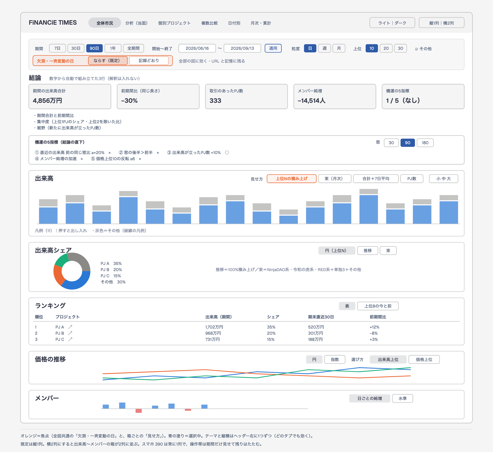
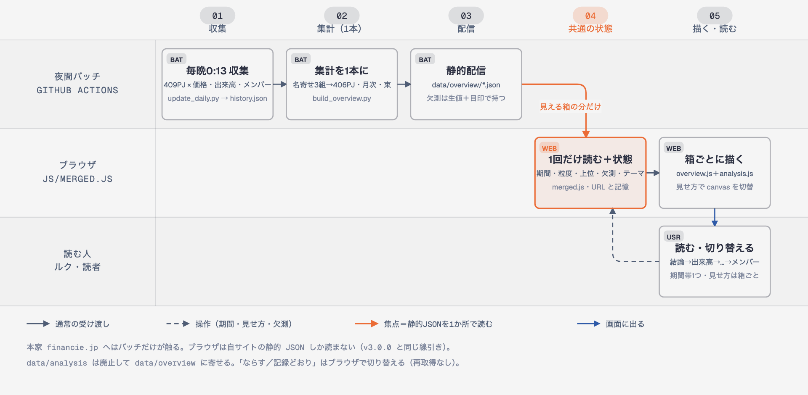
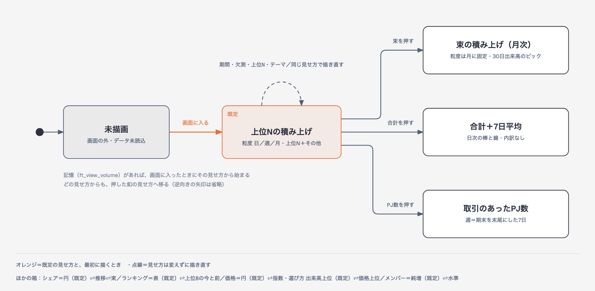

# 全体市況と「分析」の合体（ガッチャンコ）v3.2.0｜設計（2026-09-13）

- 作成：2026-09-13 09:35 JST（実測）・社長室28室目の合体担当（Opus 5。ルク 09:02 以降 Fable 不使用＝設計の相談は Astra）
- 決裁：ルク 08:26（比較表の6つ＝すべて「おすすめ」）＝[[00_products/apps/FiNANCiE-times-web/.claude/worktrees/analysis-tab/docs/2026-09-13_合体_重複機能の比較|比較表]]
- 前提の設計：[[00_products/apps/FiNANCiE-times-web/.claude/worktrees/analysis-tab/docs/2026-09-13_分析タブ_設計|分析タブ設計]]・[[00_products/apps/FiNANCiE-times-web/docs/2026-09-13_分析タブ_仕様メモ|仕様メモ]]
- 現在地：[[00_products/apps/FiNANCiE-times-web/progress|progress.md]]・[[00_products/apps/FiNANCiE-times-web/VERIFIED|VERIFIED.md]]
- 作業場所：worktree `.claude/worktrees/analysis-tab`（枝 `feature/analysis-tab`・HEAD `407dcd93`＝origin/main `cad3618d`＋日付別ランキング修正 v3.1.1 を取り込み済み）

## 結論（先に）

- **タブは「全体市況」1つ**。上に**共通の操作帯**を1本（期間・開始〜終了・粒度・上位N・その他・**欠測・一斉変動の日＝ならす／記録どおり**）。同じ指標は**1箱**にまとめ、箱の右上の**見せ方の釦**で切り替える。
- 並び＝**結論（KPI 5枚＋自動文3行）→機運の5指標→出来高→シェア→ランキング→価格→メンバー**。既定の見せ方はルク決裁どおり（積み上げ／円／円の実額／純増）。
- データは **`data/overview/` の1系統**（`build_overview.py` に名寄せ・日次系列・月次・束を足す。24H 出来高の欠測は「生の値＋目印」で持ち、ブラウザで切り替える）。`data/analysis/` は廃止。
- 描画は既存の2つの部品（`overview.js`・`analysis.js`）を残し、新しい `js/merged.js` が**読み込みと共通の状態**を持つ。書き直しは最小（検査 80＋57＋8 項目を生かす）。
- **既定の背景は白（ライト）**。色は `css/advanced.css` の CSS 変数に一元化し、グラフの文字・罫線・凡例もその変数を読む。
- 版は **v3.2.0** に1本化（分析の 0.1.0 表記はやめる）。「分析」タブは**合体版でも中身をそのまま残す**（ルク決裁1・6。本番には出さない）。

## 画面イメージ（PC 1280）

正本＝`diagrams/merge_screen.html`（SVG 同名・diagram-design 既定スキン）

- スマホ 390＝箱は常に1列。操作帯は「期間」だけ常に見せ、残り（開始〜終了・粒度・上位・その他・欠測）は「絞り込み ▾」でたたむ。
- 横2列（ヘッダーの切替）にすると、出来高〜メンバーの箱が2列に並ぶ。結論・機運・ランキングの表は常に全幅。

## 箱と見せ方

| 箱 | 見せ方（★＝既定） | 元 | 期間・粒度・上位N・欠測の効き方 |
|---|---|---|---|
| 結論 | KPI 5枚（期間合計・前期間比・取引のあったPJ数・メンバー純増・機運 n/5）＋自動文3行 | 分析 | 期間・欠測に効く。KPI の数字は欠測の切替で「ならす／記録どおり」どちらの値かを小さく書く |
| 機運の5指標 | 表（窓 30／★90／180） | 分析 | 窓は期末基準で期間ボタンとは別（仕様メモ §5）。欠測に効く（④はならす＝一斉変動の日を除いた純増） |
| 出来高 | ★上位Nの積み上げ（粒度 日／週／月）／束の積み上げ（月次・30日出来高のピック）／合計＋7日平均（日次）／取引のあったPJ数（週） | 全体市況＋分析 | 積み上げは粒度・上位N・その他に効く。束は月に固定。7日平均と PJ数は粒度に効かない（注記） |
| 出来高シェア | ★円（上位N＋その他）／推移（100%積み上げ）／束（束3＋単独3＋その他の円） | 全体市況＋分析 | 円・推移は上位N に効く。束は上位N に効かない |
| ランキング | ★表（指標＝出来高／価格／メンバー／在庫／時価総額）／上位8の今と前（横棒2本） | 全体市況＋分析 | 出来高の表に「シェア」「期末直近30日」列を足す（分析の上位30表を吸収） |
| 価格の推移 | ★円の実額／指数（期間内で最初に0より大きい日＝100）＋選び方 ★出来高上位／価格上位 | 全体市況＋分析 | 上位N に効く（価格上位も N 件） |
| メンバー | ★日ごとの純増（上位N・その他）／水準（FiNANCiE公式PJ・全PJ合計の2枚） | 全体市況＋分析 | 欠測に効く（ならす＝0落ちは前の値で埋め・一斉変動の日はその向きの増減を0） |

**重複で片方に寄せたもの**（図を1つ減らす）：分析の「週次出来高」→出来高の積み上げ（粒度＝週）／「上位5＋その他の円」→シェアの円（上位N）／「上位2PJの価格指数」→価格の指数（凡例で2つだけ残せる）／「上位30表」→ランキングの表の列。

## データの流れ

正本＝`diagrams/merge_dataflow.html`

| 段 | 何をする | どこ |
|---|---|---|
| 収集 | 毎晩 0:13 JST に 409PJ を記録（変えない） | `scripts/update_daily.py` → `data/history.json` |
| 集計（1本） | 名寄せ確定3組（仕様メモ §3・`window_compare.py` の `MERGES` と一致）→406PJ。日×PJの表7本（v24・v30・price・members・stock・mcap＋market）に、分析の `series`（日次系列）・`monthly`（月×PJの30日出来高ピック）・`bundles`（束と単独）を足す | `scripts/build_overview.py` → `data/overview/*.json`（10本）。`build_analysis.py` と `data/analysis/` は廃止 |
| 欠測の持ち方 | **v24 は生の値を入れ、`gap` に「24H＝30日の一致で取れなかった日」の目印（PJごとの日の番号の並び）を持つ**。members も生の値のまま（ならすのはブラウザ） | `data/overview/v24.json` の `gap` |
| 読み込み | `merged.js` が JSON を**1回だけ**読み、2つの部品に同じものを渡す（見える箱の分から遅延読込） | `js/merged.js` の `FtData.load(name)` |
| 描画 | `overview.js`＝積み上げ・円・推移・表・価格・純増／`analysis.js`＝結論・機運・束・7日平均・PJ数・上位8・指数・水準 | 箱の中の canvas を見せ方で出し分け |

## 見せ方の切替（状態図）

正本＝`diagrams/merge_view_state.html`

- 箱は画面に入るまで描かない（今の全体市況と同じ遅延）。入ったら既定か、記憶した見せ方で描く。
- 見せ方の釦＝その箱だけが変わる。期間・粒度・上位N・欠測・テーマ＝**見せ方はそのまま**、見えている箱だけ描き直す（隠れている見せ方は、次に出したときに描く）。

### 共通の状態（merged.js が持つ・1か所）

| 状態 | 値 | 記憶 | URL |
|---|---|---|---|
| 期間 | 7／30／★90／365／all／custom（開始・終了） | なし | 既存の全体市況のキーを使う（`?tab=` なし＝全体市況） |
| 粒度・上位N・その他・指標 | 日週月／10・20・30／on-off／5指標 | なし | 既存どおり |
| 欠測・一斉変動の日 | ★`smooth`（ならす）／`raw`（記録どおり） | `ft_gap_mode`（旧値 `exclude` は `smooth` と読み替え） | `gap=raw` のときだけ |
| 見せ方 | 箱ごと | `ft_view_<箱>` | なし |
| 機運の窓 | 30／★90／180 | なし | `an_w`（既存） |
| テーマ | ★`light`／`dark` | `ft_theme`（**記憶が無ければライト**・OS に追従しない） | なし |
| 縦横 | ★`v`／`h` | `ft_layout`（既存） | なし |

## 契約（手順0）＝Astra のレビュー（09:48）を受けて、実装の前に確定

レビュー原文＝[[00_products/apps/FiNANCiE-times-web/.claude/worktrees/analysis-tab/docs/qa/2026-09-13_Astra_合体設計レビュー|Astra 合体設計レビュー]]。方向と決裁6つは「このままでよい」。重大6点（状態の持ち主・集計の契約・メンバーの式・名寄せの境界・毎晩の処理・並行作業の前提）をここで決める。

### A. 状態と URL の持ち主＝merged.js だけ

- **merged.js が唯一の持ち主**：共通の状態（期間・開始終了・粒度・上位N・その他・指標・欠測・機運の窓・見せ方）、URL の読み書き、操作帯のイベント登録。`overview.js`・`analysis.js` は **URL を触らない**（両方の `syncUrl` を外す）・操作帯にイベントを付けない。
- 描画部品の形：`OverviewParts.render(boxId, view, state, data)`／`AnalysisParts.render(boxId, view, state, data)`／`dispose(boxId)`。Chart は箱ごとに持ち、描き直す前に必ず破棄。`state` はコピーを渡す（部品は書き換えない）。
- **旧「分析」タブ**＝`AnalysisParts` を呼ぶ薄い包み（自分の期間を持つ）。URL は merged.js が「分析タブを開いている間だけ `tab=analysis`・`an_*`」を書く。
- 遅延描画：箱ごとに「見えている」「古い（stale）」を持つ。状態が変わったら全部の箱を stale にし、見えている箱だけすぐ描く。あとで見えた箱は stale なら描く（IntersectionObserver は解除しない）。
- 読み込み：`FtData.load(name)` は**通信中の Promise も共有**（二重取得しない）。描画には世代番号を付け、古い世代の結果は捨てる。
- 優先順位＝**URL ＞ 記憶 ＞ 既定**（共有リンクを再現できる）。旧記憶 `ft_gap_mode=exclude` は `smooth` と読む。既存の全体市況の URL キーはそのまま使い、`gap=raw`・`an_w` を足す。

### B. データの契約（`data/overview/`・schema 2）

- 全ファイル共通：`days`（暦日 `YYYY-MM-DD`・昇順・全ファイルで同じ）・`projects`（406PJ・全ファイルで同じ順）・`built_at`・`schema: 2`。
- **名寄せ**：`MERGES`＝`docs/analysis_code/window_compare.py` と同じ3組。日付が重なれば後継を優先（RED は89日重複・外れる前身の生出来高 159,712円＝Astra 実測）。**表示名・slug は後継の summary の行から取る**（前身の行を先に拾わない）。
- **合体画面は前身を含む・個別ページ（`?project=`）は後継だけ**＝ランキングの注記に「名寄せした3PJは前身の記録を含みます（個別ページは現行の記録のみ）」。`data/projects/`・`data/daily/`・`data/monthly/` は変えない（既存 URL を守る）。
- `v24.json`：`rows`＝**生の volume**（精度は今の overview と同じ4桁丸め）。`gap`＝`[[pj, day], …]`＝**volume＞0 かつ volume＝volume_data の日**（丸める前に判定・null や 0＝0 は入れない）。
- `market.json`：`v24_total`・`active`・`members_total` を**持たない**。合計・PJ数・順位・シェア・機運①〜③は、ブラウザで**同じ行列と同じモード**から計算する（KPI と内訳が食い違わないように）。`days`・`first_day`・`latest`・`n`（記録のあるPJ数）だけ。
- `members.json`：生の num_member。`price`・`v30`・`stock`・`mcap`：今の形のまま（4桁）。
- `monthly.json`：月×PJ の30日出来高ピック。**PJ ごとの採用日**（`picked_day[pj][m]`＝日の番号）を持つ。ブラウザは採用日が期末より後の月を「未確定」として積み上げに入れない（先読みの防止＝Astra 中）。
- `bundles.json`：束・単独・公式PJ・MERGES。
- 生成は `scripts/build_overview.py` 1本。`build_analysis.py`・`data/analysis/` は合体の最後に消す。
- **毎晩の処理**：`daily.yml`・`metadata.yml` とも、今は集計スクリプトを呼んでいない（`update_daily.py`／`update_metadata.py` →すぐ `git add data/`）。**「Commit and push」の前に `python scripts/build_overview.py && python tests/check_overview_data.py` を入れ、失敗したら push しない。** workflow の変更は本番反映の時（今はステージングのみ）＝完了報告に手順を書く。

### C. 欠測の式（ならす＝smooth／記録どおり＝raw）

- 出来高：smooth＝gap の日は「値なし」（合計にも「取引のあったPJ数」の判定にも入れない）。raw＝生の値。**記録どおりの出来高は分析レポートと同じ数字**。
- メンバー smooth（v3.1 の `membersGapInfo` と同じ）：
  - ① **直前が100人以上の数値**で 0 が続き、**その後に正の値へ戻った区間**だけ直前の値で埋める。null を挟んだら区間は切れる。戻らない 0（停止）は埋めない。
  - ② 前日・当日が両方数値の PJ のうち、100人以上減った PJ が20件以上の日（増えた側も同じ）を一斉変動の日とし、その日は**同じ向きに動いた全PJの増減（100人未満も）を0**、逆向きは残す。
- 日次の純増 `d[pj][t]`：smooth＝①の後の差分に②を当てる／raw＝生の差分。**KPI「メンバー純増」＝選択期間の d の合計**（分析タブの「期末直近W日」から変える）。**機運④＝窓 W の d の合計**（直近W vs 前W）で別に計算。
- 水準（メンバーの箱「水準」）：smooth＝**データの初日を起点に d を累積**（期間の先頭でやり直さない）／raw＝生の値の全PJ合計（停止PJは最後の値を据え置き）。
- 注記に書くこと：**メンバーは「記録どおり」でも分析レポートとは一致しない**（レポートは0落ちを前値で埋め、再集計は水準に残す定義）。レポートの期待値（出来高 14.97M／11.15M 等）は検査に残し、メンバーの期待値はモードごとに作り直す。

### D. 期間は暦日で数える

- 7／30／90／365＝期末から**暦日**で N 日（今の全体市況は「記録の行数」で数えている＝やめる）。前期間＝同じ暦日数の直前。前期間が最初の記録日より前にかかるときは「前期間が足りない」と出す。
- 週＝期末を末尾にした暦日7日。先頭の端数は捨てて注記。

### E. テーマの対象を広げる

- 対象に `css/analysis.css`（`#analysis-view` 限定の規則は、合体の箱にも効く `.an-*` のクラスに移す）と `js/advanced.js`（個別・比較のグラフも `ft-theme-change` で描き直す。非表示なら次に出すとき）を足す。
- 変数を足す：`--tooltip-bg`・`--tooltip-text`・`--tooltip-border`・`--donut-gap`（ドーナツの隙間＝地の色）・`--volume-gradient-top`・`--volume-gradient-bottom`。
- 11系列目以降＝folder ごとに固定の色（今の青系20段）。凡例に線種の見本を出せるよう `FtLegend` に破線・点線の見本を足す。

### F. 検査に足す（M11〜M16）

| # | 見ること |
|---|---|
| M11 | 競合：低速回線で期間を連打・タブ往復・同時取得・失敗→再試行・非表示中のテーマ変更＝Chart の残り0・古い結果が上書きしない |
| M12 | URL 互換：旧全体市況キー・`an_*`・`?project=旧folder`・戻る進む・`gap` 省略と記憶 raw の優先順位 |
| M13 | 数の横断一致：KPI＝日次合計＝ランキング全件合計＝円の全切片（週の端数と月次の定義差は理由つき） |
| M14 | 境界：全0・全null・前期間不足・記録の欠けた日・初回人数・停止・復帰・名寄せの重複 |
| M15 | 月次の先読み：期末が翌月2日のとき、3〜5日の値を使わない |
| M16 | 実画面のスクロール：overflow を書き換えずに 390／768／1280・縦横・全見せ方・操作 44px |

- **旧期待値は `tests/out/baseline_v3.1/` に保存**し、名寄せによる差と欠測による差を分けて検算した表を残す。期待値は生成器と**別の実装**で作る（同じ誤りで両方通らないように）。
- 検査の Playwright の場所は `tests/lib/pw.js` の1か所にまとめ、環境変数 `FT_PLAYWRIGHT` で差し替えられるようにする。

## 決め事（ルク決裁の反映）

1. **週＝期末を末尾にした7日区切り**（決裁4）。全体市況の粒度「週」も ISO 週から変える。先頭の端数（7日に満たない週）は捨てて注記。
2. **欠測は1つの切替で全図**（決裁3・既定＝ならす）。
   - 出来高（24H）：ならす＝24H＝30日の一致の日を欠測にして合計から外す（v3.1 と同じ）。記録どおり＝生の値（分析レポートと同じ数字）。
   - メンバー：ならす＝①0に落ちて後で戻った区間は前の値で埋める ②20案件以上が同じ日に同じ向きへ100人以上動いた日（一斉の再集計・実データでは 2024-09-12・09-14・2026-06-24）は、その向きの増減を0（v3.1 の定義に統一）。記録どおり＝生の値。
   - 画面の注記は**結論から1文**（エマ中3）：「欠測の日をならしています（期間内3日）」→2行目に日付の列挙。
3. **機運5指標は結論の直下**（決裁5）。
4. **分析タブは残す・本番には出さない**（決裁1・6）。合体がステージングで通ったら、社長室の指示で釦と DOM を消す（`analysis.js` の「分析タブ用の出し先」を外すだけ）。

## 判断した点（おすすめで決めた・変えられる）

| # | 判断 | 採用 | 理由 | 代案 |
|---|---|---|---|---|
| 1 | テーマ・縦横の釦の置き場 | **ヘッダー右に1つずつ**（操作帯には置かない） | 個別・比較・日付別のタブでもテーマが要る。操作帯は全体市況にしか無い＝操作帯に置くと他のタブで切り替えられないか、釦が2つになる | 操作帯とヘッダーの両方（同期） |
| 2 | 分析タブの残し方 | **`analysis.js` を「出し先を渡して動かす」形にし、分析タブと全体市況の箱の2か所で動かす** | 決裁1＝当面残す。同じ ID を2か所に置けないため。消すときは出し先を1つ外すだけ | 分析タブを「全体市況へ移りました」の案内だけにする |
| 3 | 名寄せを全体市況にも掛ける | **掛ける（409→406PJ）** | データは1系統（比較表 #17）。同じPJが2行に割れているのは誤り。影響＝TEAM RED・肝高の山本商店・音夢パンダの3行が前身の履歴を含む | 全体市況だけ 409PJ のまま（2系統に戻る） |
| 4 | 欠測の定義 | **v3.1 の定義に統一**（メンバーは2本立て） | 分析の「直前100人以上で0なら前値」は v3.1 の①に含まれる（戻った区間だけ埋めるほうが安全＝停止PJを横ばいにしない） | 分析の定義に寄せる |
| 5 | 欠測の釦の文言 | **「ならす（既定）／記録どおり」**＋左に可視ラベル「欠測・一斉変動の日」 | エマ中1・中2（「欠測を除く」は中身＝埋める・0にすると食い違う／「小中大」と見分けがつかない） | 「欠測を除く／そのまま」 |
| 6 | 見せ方の記憶 | **箱ごとに記憶**（URL には入れない） | 期間は共有したい（URL）、見せ方は人の好み（記憶） | URL にも入れる |
| 7 | 版 | **v3.2.0 に1本化** | 再読み込みの依頼で番号が1つだと迷わない | 分析 0.2.0 を併記 |

ルクに新しく聞くことは無い（判断資料で上の7つを見せて追認をもらう）。

## テーマ（色の一元化）

- `:root` を**ライトの値**にし、`html[data-theme="dark"]` でダークの値に差し替える（今は逆＝ダークが既定）。`index.html` 先頭の1行は「記憶が `dark` のときだけ `data-theme="dark"`」に変える。
- 足す変数（名前はここで確定）：`--chart-tick`（目盛りの文字）・`--chart-grid-x`・`--chart-grid-y`（罫線）・`--chart-note`（注記）・`--series-other`（その他の灰）・`--legend-chip-border`（凡例チップの枠＝地に対して 3:1 以上・エマ中5）・`--legend-off-opacity`（非表示の項目）・`--disabled-opacity`（全部出すの非活性＝.8・エマ軽6）・`--cap-marker`（24H 出来高の上限の▲）。
- JS の固定色（overview.js 15・analysis.js 26・advanced.js 13・chart-legend.js 1）は、`getComputedStyle(document.documentElement)` で上の変数を読む関数1つ（`FtTheme.color(name)`）に寄せる。テーマを切り替えたら、見えている箱だけ描き直す。
- 系列の10色は1組に統一し、**「その他」だけ灰**（系列から灰青 `#94a3b8` を外す＝エマ中4）。凡例の「その他」は破線の見本。10色は dataviz スキルの `validate_palette.js` を**ライト・ダーク両方の地**で通す。
- 検査＝両テーマで、本文・注記・凡例・表・釦の文字が AA（4.5:1、大きい字は 3:1）、凡例チップの枠が 3:1。

## エマの残り（v3.1 再確認の6件＋日付別の軽2件）と呼び名

| 出どころ | 内容 | この設計での扱い |
|---|---|---|
| v3.1 中1 | 欠測の釦が「小中大」と同じ見た目・可視ラベルなし | 操作帯へ移し、ラベル「欠測・一斉変動の日」＋別の見た目（枠つきの組） |
| v3.1 中2 | 「欠測を除く」と中身が食い違う | 「ならす／記録どおり」（名前・注記・title の3か所で同じ語） |
| v3.1 中3 | 注記が長く、結論が最後 | 1文目を結論に・日付は2行目・2つのモードで同じ骨格 |
| v3.1 中4 | 灰青と「その他」の灰が近い（ΔE 19） | 系列から灰系を外す・その他は破線の凡例 |
| v3.1 中5 | 凡例チップの枠が地に対し 1.15〜1.28:1 | `--legend-chip-border` を 3:1 以上 |
| v3.1 軽6 | 全部出すの非活性 | `--disabled-opacity: .8` |
| 日付別 軽1 | 列の呼び名が3通り | 下の呼び名に統一 |
| 日付別 軽2 | スマホの並べ替え釦 29px | 操作帯・並べ替えの釦をスマホで高さ 44px 以上 |

**呼び名の統一**＝「取引量」→「出来高」、「24h」→「24H」。対象（index.html の見出し・表の列・注記・JS の系列名）：「24H 取引量の推移 (円)」→「24H 出来高の推移（円）」・「24H 取引量の比較 (円)」→「24H 出来高の比較（円）」・「月次・累積取引量ランキング」→「月次・累計の出来高ランキング」・「期間総取引量 (円)」→「期間の出来高合計（円）」・「出来高 24h［千円］」→「24H 出来高［千円］」・脚注「24h出来高」→「24H 出来高」。括弧は全角にそろえる。

## 検査（tests/check_merged.js を新設・既存3本は定義の変更だけ直す）

| # | 見ること |
|---|---|
| M1 | タブの釦に「全体市況」が1つ・操作帯は1本（期間の組・欠測の組・テーマ釦・縦横釦が各1つ） |
| M2 | 5つの箱の全部の見せ方で、グラフが空でない（90日・全期間・スマホ 390） |
| M3 | 欠測の切替：ならす＝`reference_overview.py` の期間合計と一致／記録どおり＝`reference_analysis.py`（レポートの 14.97M／11.15M・終了 2026-09-11 固定）と一致。メンバーの 2026-06-24 は ならす＝0・記録どおり＝−15,611 |
| M4 | 週＝期末を末尾にした7日（最後の週の終わりが期末日・端数の注記） |
| M5 | 名寄せ＝`build_overview.py` の MERGES が `window_compare.py` の MERGES と完全一致（B0 の型）・406PJ・パティスリー→鹿児島タイムズは別PJ |
| M6 | テーマ：記憶なしで開くとライト・切り替えると記憶・両テーマの AA（文字 4.5:1・凡例チップの枠 3:1） |
| M7 | 見せ方の記憶（再読み込みで保持）・期間を変えても見せ方が保たれる |
| M8 | 横はみ出し 0（1280・390）・スマホの表の全 td に data-label |
| M9 | 画面の文字に「取引量」「24h」（小文字）が0件 |
| M10 | 日付別ランキングの並べ替え（`check_daily_sort.js` をそのまま回す） |

既存の検査で定義が変わるもの：`check_overview.js` の週（ISO→期末末尾）・PJ数（409→406）・A42 のカードの数え方（`#overview-view` に絞る＝分析の箱を数えていた）／`check_analysis.js` の B22（横2列）＝`css/overview.css` の「`.ov-charts-grid` は常に1列」を外し、縦横の切替に任せる（ルク 07:08 の縦横切替が 06:45 の横長1列より新しい指示）。

## 実装の手順（契約を受けて変更）

| 順 | 中身 | 担当 | 触らないもの |
|---|---|---|---|
| 0 | 契約（上の A〜F）を確定 | 担当 | ― |
| 1 | `build_overview.py` を契約 B・C どおりに（schema 2・名寄せ・gap・monthly の採用日・series と bundles）＋`tests/check_overview_data.py`（件数・days の一致・MERGES の一致・gap の条件・採用日・サイズ）＋`tests/reference_merged.py`（history.json から**別実装**の期待値・名寄せ差と欠測差の表）＋旧期待値の保存 | dev-coder（Sonnet）・並行 | js・css・index.html・workflows |
| 2 | `js/analysis.js` を「集計（純粋関数）」「箱ごとの描画 render／dispose」「旧タブの包み」に分ける。手順1の出力が来るまでは、今の data/overview＋data/analysis から契約の形に組み立てる**テスト専用の変換**で動かす。`check_analysis.js` が通ること | dev-coder（Sonnet）・並行 | index.html・merged.js・overview.js・URL |
| 3 | テーマ（済み：CSS の変数と既定ライト）→ JS の色を `FtTheme` に・`ft-theme-change`・analysis.css | 担当（Opus） | ― |
| 4 | `js/merged.js`（状態・URL・FtData・世代番号・見えている／古い）・`overview.js` の描画分離・`index.html` の操作帯と箱の並び・`css/layout.css`・タブ経路 | 担当 | ― |
| 5 | エマの残り・呼び名・版 v3.2.0・ステージング入口を `?tab=analysis` から全体市況へ | 担当 | ― |
| 6 | `tests/check_merged.js`（M1〜M16）＋既存3本の移行→ステージング（`financie-times-analysis-staging`）→断（軽）→エマ（PC 1280 主・390）→VERIFIED→完了報告→判断資料 HTML | 担当 | ― |

## 触るときの注意

- 追加要望は溜めてから1周（配信と検収を要望のたびに回さない＝dev の `_RULE.md` 2026-09-13）。
- 本番・push・分析タブの削除はしない。本番に出すときは「分析タブの釦を出さない」形で（決裁6）。
- 日次データは毎晩増える＝検査の期待値（reference）はデータ最終日に依存。赤になったらまず `git log -3` と data の最終日。
- `data/overview/` のファイルが大きい（v24 1.5MB・mcap 2.8MB 等）＝名寄せ後にサイズを測り、25MiB 超を配信スクリプトが止めることを確かめる。
